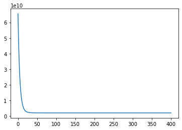

title: Coursera Machine Learning - Linear Regression Implemented in Python
date: 2020-02-03
author: Abhishek Saini

# Week 2 - Linear Regression

This post is part of a series of posts where I will share Python implementations of the assignments from [Andrew NG's Machine Learning course](https://www.coursera.org/learn/machine-learning/home/welcome).

I will not be going into the details of the machine learning algorithms. Instead, the focus will be on **implementing the logic in Python**.

## Installation

### Operating System

If you are using Windows, I recommend you install Ubuntu purely because most of the machine learning libraries work better on a Linux based operating system. **Ubuntu 18.04 LTS** would be my choice as it is more stable than the non-LTS versions and it will be supported till 2023.

### Python Environment

Follow the instructions below to install Anaconda, Jupyter Lab and Ipyvolume on an Ubuntu 18.04. If you are using any other OS, you just have to replicate these steps. Jupyter Lab is an excellent tool to get started with learning Python. Instructions for installing Jupyter Lab are adapted from [this Github page](https://github.com/jupyterlab/scipy2019-jupyterlab-tutorial#installation). 

1. Install either the full anaconda distribution (very large, includes lots of conda packages by default) or miniconda (much smaller, with only essential packages by default, but any conda package can be installed).
2. Set up a new Conda environment. This creates a new environment called *coursera_ml_python*

    conda create -n coursera_ml_python --override-channels --strict-channel-priority -c conda-forge -c anaconda --yes jupyterlab=1 ipywidgets nodejs pip cookiecutter pandas=0.24 matplotlib python=3.6

3. Activate the new conda environment

    conda activate coursera_ml_python

4. Install extra Jupyter Lab extensions

    jupyter labextension install @jupyter-widgets/jupyterlab-manager @jupyterlab/geojson-extension @jupyterlab/toc

Now you should have two important tools installed in your system: Conda and Jupyter Lab.

**Conda** is used to manage multiple environments. Read this excellent [write up by Gergely Szerovay](https://protostar.space/why-you-need-python-environments-and-how-to-manage-them-with-conda) to understand why you might need multiple Python environments.

While **Jupyter Lab** is a web-based IDE with the philosophy of enabling interactive computing. Check out [this video](https://www.youtube.com/watch?v=Gzun8PpyBCo) for a beginner level introduction.

5. Install ipyvolume, a tool for creating interactive 3D plots within Jupyter Lab. (Steps taken from [the official page](https://ipyvolume.readthedocs.io/en/latest/install.html#conda-anaconda))

    conda install -c conda-forge ipyvolume
    conda install -c conda-forge nodejs
    jupyter labextension install ipyvolume
    jupyter labextension install jupyter-threejs

6. Download the code for this tutorial from [this link]()

    git clone

7. Run Juypter Lab

    jupyter lab

## Linear Regression Implementation in Python

**Note:** We will only consider multivariable linear regression in this post since the same piece of code will also work with single variable.

### 1. Visualization

Now that we have installed the relevant libraries, let's import and visualize the data. 


```python
# Import relevant libraries here

import numpy as np
import matplotlib.pyplot as plt
import ipyvolume as ipv
from cost_compute import cost_compute
from feature_normalization import feature_normalization
from grad_descent import grad_descent
from plot_3d_scatter import plot_3d_scatter
from plot_best_fit_plane import plot_best_fit_plane
```


```python
# Load and manipulate data

data = np.loadtxt('ex1data2.txt', delimiter = ',')
print('\nData from file loaded successfully\n')

m = data.shape[0]
n = data.shape[1]
X = data[:,tuple(range(n-1))]
y = data[:,-1]
```

    
    Data from file loaded successfully
    


The function `plot_3d_scatter` contains the code for the 3d plot shown below. We use ipyvolume to create the three-dimensional interactive scatter plot. You can easily see there is a pattern in the data. Through linear regression, we will fit a plane that best captures the pattern.


```python
# 3D scatter plot of house price vs area and number of bedrooms 
plot_3d_scatter(data, y, True)
```


    VBox(children=(Figure(camera=PerspectiveCamera(fov=46.0, position=(0.0, 0.0, 2.0), quaternion=(0.0, 0.0, 0.0, …


    Animation saved to scatter_3d.html

<div class="jsfiddle">
<iframe allowfullscreen="allowfullscreen" frameborder="0" height="600" src="http://jsfiddle.net/yxe7fn9z/embedded/result/light/" width="100%">
</iframe>
</div>

### 2. Feature Normalization

Our features area and number of number of bedrooms differ significantly in their orders of magnitude. In such cases, feature scaling is necessary to ensure gradient descent converges quickly.


```python
# Normalize feature variable X
X, mu, sigma = feature_normalization(X)
```

### 3. Cost Function

In the entire series, I shall prefer vectorized operations instead of for loops wherever possible. To implement vectorization we shall pad our feature with ones, so we can vectorize our hypothesis function  
  

$$
\begin{equation*}
h_{\theta}(X) = \begin{bmatrix} \theta_{0}+\theta_{1}x^{(1)}_{1}+\cdots +\theta_{n}x^{(1)}_{n}
\\ \theta_{0}+\theta_{1}x^{(2)}_{1}+\cdots +\theta_{n}x^{(2)}_{n}
\\ \vdots 
\\ \theta_{0}+\theta_{1}x^{(m)}_{1}+\cdots +\theta_{n}x^{(m)}_{n}
\end{bmatrix}
= \begin{bmatrix}
1 & x^{(1)}_{1} & \cdots & x^{(1)}_{n} \\ 
1 & x^{(2)}_{1} & \cdots & x^{(2)}_{n} \\ 
\vdots & \vdots & \vdots & \vdots \\ 
1 & x^{(m)}_{1} & \cdots & x^{(m)}_{n}
\end{bmatrix} \times \begin{bmatrix}
\theta_{0}\\ 
\theta_{1}\\ 
\vdots \\ 
\theta_{n}
\end{bmatrix}=X\theta
\end{equation*}
$$


```python
# Pad feature vaiable with ones
X = np.c_[np.ones(m), X]  
theta = np.zeros(n)
```

$\theta$ is initialized as a zero vector.


```python
# Compute cost of the initialized theta vector
J = cost_compute(X, y, theta, m)
print('The initial cost is', J)
```

    The initial cost is 65591548106.45744


### 4. Gradient Descent Vectorized Implementation

Each for loop in the function `grad_descent` updates $\theta$ as follows. Note that this is a batch update.

$$
\begin{equation*}
\theta^{j}:=\theta^{j}-\frac{\alpha}{m}X^T\left ( X\theta-y \right )
\end{equation*}
$$


```python
# Set values before running Gradient Descent
theta = np.zeros(n)
alpha = 0.1
num_iters = 400
J_history = np.zeros(num_iters+1)

# Get optimized theta variable and cost vs number of iterations
theta, J_history = grad_descent(theta, X, y, m, num_iters, alpha, J_history)

```

### 5. Tuning the learning rate

Run Gradient Descent multiple times by changing learning rate alpha until it converges fast.


```python
# Cost vs number of iterations
plt.plot(J_history)
```


    [<matplotlib.lines.Line2D at 0x7f0d15ab8ba8>]





### 6. Normal Equation

Now let's find the optimal theta parameters using the normal equations.


```python
# Reset X for solving the Normal Equation
X = data[:,tuple(range(n-1))]
X = np.c_[np.ones(m), X]
```

According to the Normal Equation,

$$
\begin{equation*}
\theta = \left ( X^TX \right )^{-1}X^Ty
\end{equation*}
$$


```python
# Normal Equation
theta_normal = np.matmul(np.linalg.pinv(np.matmul(X.T, X)), np.matmul(X.T, y))
```

### 7. Comparing predictions from Normal Equation and Gradient Descent
Now let's make predictions for a 3 bedroom house with area 1650 sq. ft. using theta_normal (normal equation) and theta (gradient descent)


```python
# Prediction using theta parameters from Normal Equation
x_test = np.array([1.0, 1650.0, 3.0])
y_predict = np.dot(theta_normal, x_test)

# Prediction using theta parameters from Gradient Descent
mu = np.r_[np.zeros(1), mu]
sigma = np.r_[np.ones(1), sigma]
x_test_feat_norm = (x_test - mu)/(sigma)
y_predict_feat_norm = np.dot(theta, x_test_feat_norm)
```


```python
print('Normal Equation solution predicts house price USD'+str(y_predict)+'\n'+
      'Gradient Descent solution predicts house price USD'+str(y_predict_feat_norm))
```

    Normal Equation solution predicts house price $293081.4643349715
    Gradient Descent solution predicts house price $293081.4645291686


Normal Equation and Gradient Descent both result in very similar predictions!

### 8. Visualizing the Hypothesis Plane

Lastly, we plot the hypothesis plane along with the scatter plot to see how the hypothesis fits our data. The point in yellow is the price prediction for house with area 1,650 sq. ft and 3 bedrooms.


```python
# Visualize the hypothesis plane
plot_best_fit_plane(data, y, theta_normal, x_test, y_predict, True)
```


    VBox(children=(Figure(camera=PerspectiveCamera(fov=46.0, position=(0.0, 0.0, 2.0), quaternion=(0.0, 0.0, 0.0, …


    Animation saved to scatter_plane_3d.html

<div class="jsfiddle">
<iframe allowfullscreen="allowfullscreen" frameborder="0" height="600" src="http://jsfiddle.net/71rbs8dL/embedded/result/light/" width="100%">
</iframe>
</div>

## Conclusion

This concludes the implementation of Linear Regression using Python. Please feel free to share your thoughts in the comments.
